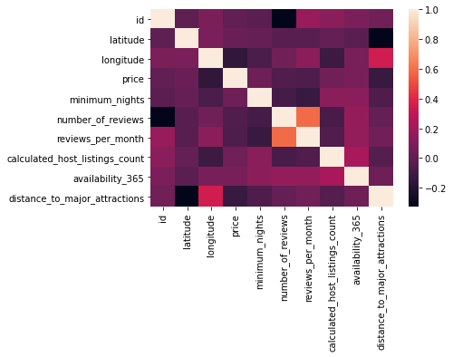
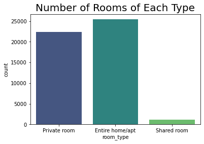
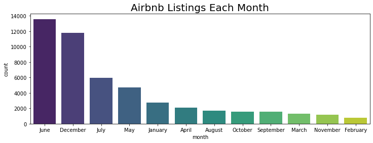
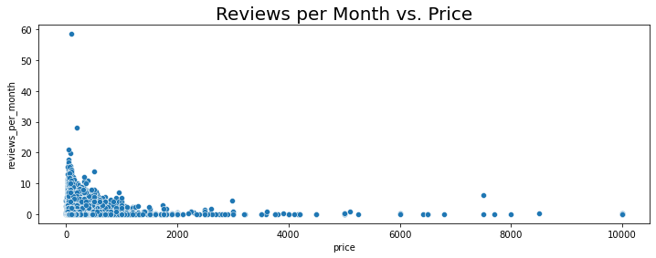
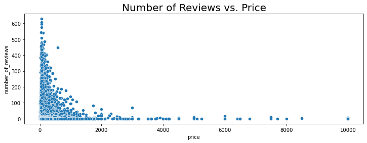
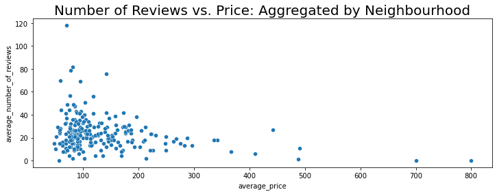
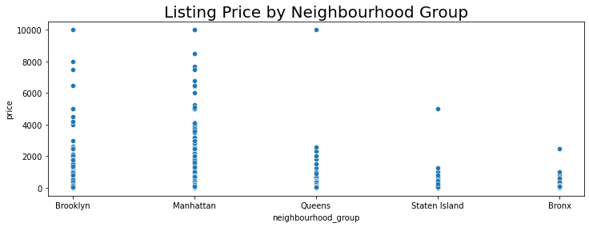
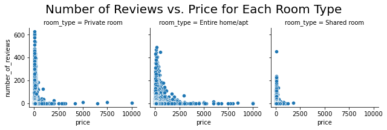

# Airbnb NYC Listings Data Analysis


<b>Context</b>

Analysis of a public Airbnb dataset from Kaggle: https://www.kaggle.com/dgomonov/new-york-city-airbnb-open-data

Dataset describes the Airbnb listing activity and metrics in NYC, NY for 2019. It includes all needed information to find out more about hosts, geographical availability, necessary metrics to make predictions and draw conclusions.


```python
import numpy as np
import pandas as pd
```


```python
import matplotlib.pyplot as plt
import seaborn as sns
import datetime
```


```python
%matplotlib inline
```


```python
nyc_df = pd.read_csv('AB_NYC_2019.csv')
```


```python
nyc_df.head()
```


<div>
<style scoped>
    .dataframe tbody tr th:only-of-type {
        vertical-align: middle;
    }

    .dataframe tbody tr th {
        vertical-align: top;
    }

    .dataframe thead th {
        text-align: right;
    }
</style>
<table border="1" class="dataframe">
  <thead>
    <tr style="text-align: right;">
      <th></th>
      <th>id</th>
      <th>name</th>
      <th>host_id</th>
      <th>host_name</th>
      <th>neighbourhood_group</th>
      <th>neighbourhood</th>
      <th>latitude</th>
      <th>longitude</th>
      <th>room_type</th>
      <th>price</th>
      <th>minimum_nights</th>
      <th>number_of_reviews</th>
      <th>last_review</th>
      <th>reviews_per_month</th>
      <th>calculated_host_listings_count</th>
      <th>availability_365</th>
    </tr>
  </thead>
  <tbody>
    <tr>
      <th>0</th>
      <td>2539</td>
      <td>Clean &amp; quiet apt home by the park</td>
      <td>2787</td>
      <td>John</td>
      <td>Brooklyn</td>
      <td>Kensington</td>
      <td>40.64749</td>
      <td>-73.97237</td>
      <td>Private room</td>
      <td>149</td>
      <td>1</td>
      <td>9</td>
      <td>2018-10-19</td>
      <td>0.21</td>
      <td>6</td>
      <td>365</td>
    </tr>
    <tr>
      <th>1</th>
      <td>2595</td>
      <td>Skylit Midtown Castle</td>
      <td>2845</td>
      <td>Jennifer</td>
      <td>Manhattan</td>
      <td>Midtown</td>
      <td>40.75362</td>
      <td>-73.98377</td>
      <td>Entire home/apt</td>
      <td>225</td>
      <td>1</td>
      <td>45</td>
      <td>2019-05-21</td>
      <td>0.38</td>
      <td>2</td>
      <td>355</td>
    </tr>
    <tr>
      <th>2</th>
      <td>3647</td>
      <td>THE VILLAGE OF HARLEM....NEW YORK !</td>
      <td>4632</td>
      <td>Elisabeth</td>
      <td>Manhattan</td>
      <td>Harlem</td>
      <td>40.80902</td>
      <td>-73.94190</td>
      <td>Private room</td>
      <td>150</td>
      <td>3</td>
      <td>0</td>
      <td>NaN</td>
      <td>NaN</td>
      <td>1</td>
      <td>365</td>
    </tr>
    <tr>
      <th>3</th>
      <td>3831</td>
      <td>Cozy Entire Floor of Brownstone</td>
      <td>4869</td>
      <td>LisaRoxanne</td>
      <td>Brooklyn</td>
      <td>Clinton Hill</td>
      <td>40.68514</td>
      <td>-73.95976</td>
      <td>Entire home/apt</td>
      <td>89</td>
      <td>1</td>
      <td>270</td>
      <td>2019-07-05</td>
      <td>4.64</td>
      <td>1</td>
      <td>194</td>
    </tr>
    <tr>
      <th>4</th>
      <td>5022</td>
      <td>Entire Apt: Spacious Studio/Loft by central park</td>
      <td>7192</td>
      <td>Laura</td>
      <td>Manhattan</td>
      <td>East Harlem</td>
      <td>40.79851</td>
      <td>-73.94399</td>
      <td>Entire home/apt</td>
      <td>80</td>
      <td>10</td>
      <td>9</td>
      <td>2018-11-19</td>
      <td>0.10</td>
      <td>1</td>
      <td>0</td>
    </tr>
  </tbody>
</table>
</div>


Based on the raw data provided we can explore the following questions:
- Which neighbourhoods are the most/least expensive?
- What is the average price for listings in each listing?
- Which neighbourhoods are the most/least reviewed?
- What types of rooms are most popular?

# Data Cleaning and Preparation

In this stage the data is checked for accuracy and completeness prior to beginning the analysis. 

- Removing extraneous data and outliers.
- Filling in missing values.
- Conforming data to a standardized pattern.
- Identifying errors revealed when new variables are created.
- Deleting data that cannot be corrected.

# Checking for missing values


```python
nyc_df.info()
```

    <class 'pandas.core.frame.DataFrame'>
    RangeIndex: 48895 entries, 0 to 48894
    Data columns (total 16 columns):
     #   Column                          Non-Null Count  Dtype  
    ---  ------                          --------------  -----  
     0   id                              48895 non-null  int64  
     1   name                            48879 non-null  object 
     2   host_id                         48895 non-null  int64  
     3   host_name                       48874 non-null  object 
     4   neighbourhood_group             48895 non-null  object 
     5   neighbourhood                   48895 non-null  object 
     6   latitude                        48895 non-null  float64
     7   longitude                       48895 non-null  float64
     8   room_type                       48895 non-null  object 
     9   price                           48895 non-null  int64  
     10  minimum_nights                  48895 non-null  int64  
     11  number_of_reviews               48895 non-null  int64  
     12  last_review                     38843 non-null  object 
     13  reviews_per_month               38843 non-null  float64
     14  calculated_host_listings_count  48895 non-null  int64  
     15  availability_365                48895 non-null  int64  
    dtypes: float64(3), int64(7), object(6)
    memory usage: 6.0+ MB
    

The name, host_name, last_review and reviews_per_month columns have missing values.   

The missing values originate from a variety of reasons:

- The host or person inputting data may have forgotten to enter the value.
- Hardware or software error during the collection is affecting accuracy of trip data and so on.

Additionally, it is recommended to make the above values a required field for listing data collection purposes to avoid missing data in the future.

# Identifying and Replacing Missing Values


```python
##Rows with missing value for last_review

nyc_df['name'].isnull().value_counts() 
```


    False    48879
    True        16
    Name: name, dtype: int64


```python
##Rows with missing value for last_review

nyc_df['host_name'].isnull().value_counts() 
```


    False    48874
    True        21
    Name: host_name, dtype: int64


```python
##Rows with missing value for last_review

nyc_df['last_review'].isnull().value_counts() 
```


    False    38843
    True     10052
    Name: last_review, dtype: int64


```python
##Rows with missing value for reviews_per_month

nyc_df['reviews_per_month'].isnull().value_counts() 
```


    False    38843
    True     10052
    Name: reviews_per_month, dtype: int64


The majority of the missing data is from the "last_review" and "reviews_per_month" columns. Since the other two columns only have relatively few missing values we can just delete the associated rows. 

### Replacing Missing Values

The reviews_per_month and last_review values are connected to each other. The missing values represent the fact that a review has not been left for that listing. 

- The reviews_per_month will be replaced with a score of 0.0.
- The last_review will be set to "2019-12-31" to indicate there has been no review as of the last day of the year.


```python
#Replacing missing values
nyc_df['reviews_per_month'] = nyc_df['reviews_per_month'].fillna(0.0)
```


```python
## We have replaced all the missing reviews_per_month with a 0.0

nyc_df['reviews_per_month'].isnull().value_counts() 
```


    False    48895
    Name: reviews_per_month, dtype: int64


```python
#Replacing missing values
nyc_df['last_review'] = nyc_df['last_review'].fillna("2019-12-31")
```


```python
##Rows with missing value for last_review

nyc_df['last_review'].isnull().value_counts() 
```


    False    48895
    Name: last_review, dtype: int64


### Deleting Missing Values


```python
#Deleting rows with missing name values
nyc_df.dropna(subset=['name'], inplace=True)
```


```python
#Deleting rows with missing 'host_name' values
nyc_df.dropna(subset=['host_name'], inplace=True)
```


```python
nyc_df.info()
```

    <class 'pandas.core.frame.DataFrame'>
    Int64Index: 48858 entries, 0 to 48894
    Data columns (total 16 columns):
     #   Column                          Non-Null Count  Dtype  
    ---  ------                          --------------  -----  
     0   id                              48858 non-null  int64  
     1   name                            48858 non-null  object 
     2   host_id                         48858 non-null  int64  
     3   host_name                       48858 non-null  object 
     4   neighbourhood_group             48858 non-null  object 
     5   neighbourhood                   48858 non-null  object 
     6   latitude                        48858 non-null  float64
     7   longitude                       48858 non-null  float64
     8   room_type                       48858 non-null  object 
     9   price                           48858 non-null  int64  
     10  minimum_nights                  48858 non-null  int64  
     11  number_of_reviews               48858 non-null  int64  
     12  last_review                     48858 non-null  object 
     13  reviews_per_month               48858 non-null  float64
     14  calculated_host_listings_count  48858 non-null  int64  
     15  availability_365                48858 non-null  int64  
    dtypes: float64(3), int64(7), object(6)
    memory usage: 6.3+ MB
    

All missing values have been dealt with.

## Correcting formatting issues in data


```python
#Converting last_review to datetime values 
nyc_df['last_review'] = pd.to_datetime(nyc_df['last_review'])
```


```python
#Converting host_id to string
nyc_df['host_id'] = nyc_df['host_id'].astype(str)
```

## Creating new features

In this stage we are adding new features that will provide more insight into the data.

### Month


```python
#Identifying which month the review was left

nyc_df['month'] = nyc_df['last_review'].apply(lambda time: time.month)
```


```python
#We needs to convert the values in the Month column from numbers to names of Months

dmap = {1:'January',2:'February',3:'March',4:'April',5:'May',6:'June',7:'July',8:'August',9:'September',10:'October',11:'November',12:'December'}
```


```python
#Mapping our new dictionary to the Month column in the Dataframe

nyc_df['month'] = nyc_df['month'].map(dmap)
```

### Listing Coordinates

<b>'listing_coordinate'</b> is the latitude and longitude pair for each listing that can be used to calculate distances to other points.


```python
#Creating a dataframe for latitude and longitude of each listing
locations_df = nyc_df[["latitude","longitude"]]

#Creating a list of tuples
locations_df = locations_df.to_records(index=False)

#There is now a column 'locations' with the latitude and longitude pair for each listing. Example, 
nyc_df['listing_coordinates'] = list(locations_df) 
```

### Major Attactions and Major Attraction Coordinates

The neighbourhood groups represent the boroughs of New York City. As people use Airbnb for short visits primarily it is useful to know how far  listings are from popular locations in each borough like Central Park in Manhattan.


```python
#Identifying unique neighbourhoods groups (boroughs)
nyc_df['neighbourhood_group'].unique()
```


    array(['Brooklyn', 'Manhattan', 'Queens', 'Staten Island', 'Bronx'],
          dtype=object)


Major Attraction in Each Neighbourhoods Group (Borough)
- Brooklyn: Brooklyn Bridge
- Manhattan: Central Park
- Queens: Citi Field  
- Staten Island: St. George's Ferry Terminal (Staten Island Ferry)
- Bronx: Bronx Zoo


```python
#Coordinates of Major Attractions

brooklyn_bridge = (40.706001,-73.997002)
central_park = (40.769361,-73.977655)
citi_field = (40.75416365,-73.84082997)
staten_island_ferry = (40.643333,-74.074167) 
bronx_zoo = (40.852905,-73.872971)

#Creating a dictionary with the values in the neighbourhood group column to the names of the related attraction
dmap_locations = {'Brooklyn':"Brooklyn Bridge", 'Manhattan':"Central Park", 'Queens':"Citi Field", 'Staten Island':"St. Georges Ferry Terminal", 'Bronx':"Bronx Zoo"}

#Creating a dictionary with the values in the neighbourhood group column to the coordinates of the related attraction
dmap_coordinates = {'Brooklyn':brooklyn_bridge, 'Manhattan':central_park, 'Queens':citi_field, 'Staten Island':staten_island_ferry, 'Bronx':bronx_zoo}

#Mapping our new dictionary to the neighbourhood_group column in the Dataframe
nyc_df['major_attraction_location'] = nyc_df['neighbourhood_group'].map(dmap_locations)

#Mapping our new dictionary to the neighbourhood_group column in the Dataframe
nyc_df['major_attraction_coordinates'] = nyc_df['neighbourhood_group'].map(dmap_coordinates)

```

### Distance to Major Attactions


```python
import haversine
from haversine import haversine, Unit

#haversine can calculate the distance (in various units) between two points on Earth using their latitude and longitude.


# We use the lambda function to apply haversine to calculate the distance to central park from each listing in Miles
# The default units for haversine are Km but we have set it to Miles here
# x.listing_coordinates and x.major_attraction_coordinates represent the coordinates of the listing location and the major attraction
nyc_df['distance_to_major_attractions'] = nyc_df.apply(lambda x: haversine(x.listing_coordinates,x.major_attraction_coordinates,unit=Unit.MILES), axis = 1)

#Rounding the values for readability
nyc_df['distance_to_major_attractions'] = nyc_df['distance_to_major_attractions'].round(2)

```

# Data Analysis and Visualization

In this stage, we will examine the data to identify any patterns, trends and relationships between the variables. It will help us analyze the data and extract insights that can be used to make decisions.

Data Visualization will give us a clear idea of what the data means by giving it visual context.

## Checking for any correlation in the data


```python
sns.heatmap(nyc_df.corr())
```


    <AxesSubplot:>


    

    


There does not appear to be any significant correlation between variables

## Host ID


```python
nyc_df['host_id'].describe()
```


    count         48858
    unique        37425
    top       219517861
    freq            327
    Name: host_id, dtype: object


There are <b>37425</b> unique hosts with host <b>219517861</b> having the most listings (327).


```python
nyc_df[nyc_df['host_id'] == '219517861'].head()
```


<div>
<style scoped>
    .dataframe tbody tr th:only-of-type {
        vertical-align: middle;
    }

    .dataframe tbody tr th {
        vertical-align: top;
    }

    .dataframe thead th {
        text-align: right;
    }
</style>
<table border="1" class="dataframe">
  <thead>
    <tr style="text-align: right;">
      <th></th>
      <th>id</th>
      <th>name</th>
      <th>host_id</th>
      <th>host_name</th>
      <th>neighbourhood_group</th>
      <th>neighbourhood</th>
      <th>latitude</th>
      <th>longitude</th>
      <th>room_type</th>
      <th>price</th>
      <th>...</th>
      <th>number_of_reviews</th>
      <th>last_review</th>
      <th>reviews_per_month</th>
      <th>calculated_host_listings_count</th>
      <th>availability_365</th>
      <th>month</th>
      <th>listing_coordinates</th>
      <th>major_attraction_location</th>
      <th>major_attraction_coordinates</th>
      <th>distance_to_major_attractions</th>
    </tr>
  </thead>
  <tbody>
    <tr>
      <th>38293</th>
      <td>30181691</td>
      <td>Sonder | 180 Water | Incredible 2BR + Rooftop</td>
      <td>219517861</td>
      <td>Sonder (NYC)</td>
      <td>Manhattan</td>
      <td>Financial District</td>
      <td>40.70637</td>
      <td>-74.00645</td>
      <td>Entire home/apt</td>
      <td>302</td>
      <td>...</td>
      <td>0</td>
      <td>2019-12-31</td>
      <td>0.00</td>
      <td>327</td>
      <td>309</td>
      <td>December</td>
      <td>[40.70637, -74.00645]</td>
      <td>Central Park</td>
      <td>(40.769361, -73.977655)</td>
      <td>4.61</td>
    </tr>
    <tr>
      <th>38294</th>
      <td>30181945</td>
      <td>Sonder | 180 Water | Premier 1BR + Rooftop</td>
      <td>219517861</td>
      <td>Sonder (NYC)</td>
      <td>Manhattan</td>
      <td>Financial District</td>
      <td>40.70771</td>
      <td>-74.00641</td>
      <td>Entire home/apt</td>
      <td>229</td>
      <td>...</td>
      <td>1</td>
      <td>2019-05-29</td>
      <td>0.73</td>
      <td>327</td>
      <td>219</td>
      <td>May</td>
      <td>[40.70771, -74.00641]</td>
      <td>Central Park</td>
      <td>(40.769361, -73.977655)</td>
      <td>4.52</td>
    </tr>
    <tr>
      <th>38588</th>
      <td>30347708</td>
      <td>Sonder | 180 Water | Charming 1BR + Rooftop</td>
      <td>219517861</td>
      <td>Sonder (NYC)</td>
      <td>Manhattan</td>
      <td>Financial District</td>
      <td>40.70743</td>
      <td>-74.00443</td>
      <td>Entire home/apt</td>
      <td>232</td>
      <td>...</td>
      <td>1</td>
      <td>2019-05-21</td>
      <td>0.60</td>
      <td>327</td>
      <td>159</td>
      <td>May</td>
      <td>[40.70743, -74.00443]</td>
      <td>Central Park</td>
      <td>(40.769361, -73.977655)</td>
      <td>4.50</td>
    </tr>
    <tr>
      <th>39769</th>
      <td>30937590</td>
      <td>Sonder | The Nash | Artsy 1BR + Rooftop</td>
      <td>219517861</td>
      <td>Sonder (NYC)</td>
      <td>Manhattan</td>
      <td>Murray Hill</td>
      <td>40.74792</td>
      <td>-73.97614</td>
      <td>Entire home/apt</td>
      <td>262</td>
      <td>...</td>
      <td>8</td>
      <td>2019-06-09</td>
      <td>1.86</td>
      <td>327</td>
      <td>91</td>
      <td>June</td>
      <td>[40.74792, -73.97614]</td>
      <td>Central Park</td>
      <td>(40.769361, -73.977655)</td>
      <td>1.48</td>
    </tr>
    <tr>
      <th>39770</th>
      <td>30937591</td>
      <td>Sonder | The Nash | Lovely Studio + Rooftop</td>
      <td>219517861</td>
      <td>Sonder (NYC)</td>
      <td>Manhattan</td>
      <td>Murray Hill</td>
      <td>40.74771</td>
      <td>-73.97528</td>
      <td>Entire home/apt</td>
      <td>255</td>
      <td>...</td>
      <td>14</td>
      <td>2019-06-10</td>
      <td>2.59</td>
      <td>327</td>
      <td>81</td>
      <td>June</td>
      <td>[40.74771, -73.97528]</td>
      <td>Central Park</td>
      <td>(40.769361, -73.977655)</td>
      <td>1.50</td>
    </tr>
  </tbody>
</table>
<p>5 rows × 21 columns</p>
</div>


The top host <i>(219517861)</i>  is <b>Sonder (NYC)</b>

## Neighbourhood 


```python
nyc_df['neighbourhood'].describe()
```


    count            48858
    unique             221
    top       Williamsburg
    freq              3917
    Name: neighbourhood, dtype: object


There are <b>221</b> neighbourhoods with <b>Williamsburg</b> having the most listings (3917). 

### Top 10 Neighbourhoods with the Most Listings


```python
nyc_df['neighbourhood'].value_counts().head(10)
```


    Williamsburg          3917
    Bedford-Stuyvesant    3713
    Harlem                2655
    Bushwick              2462
    Upper West Side       1969
    Hell's Kitchen        1954
    East Village          1852
    Upper East Side       1797
    Crown Heights         1563
    Midtown               1545
    Name: neighbourhood, dtype: int64


```python
#Calulating the total number of listings that the top 10 neighbourhoods account for
nyc_df['neighbourhood'].value_counts().head(10).sum()
```


    23427


```python
round((23427/48858)*100,2)
```


    47.95


The top 10 neighbourhoods represent about <b>47.95%</b> of all listings.

## Neighbourhood Groups


```python
#Identifying unique neighbourhoods
nyc_df['neighbourhood_group'].describe()
```


    count         48858
    unique            5
    top       Manhattan
    freq          21643
    Name: neighbourhood_group, dtype: object


There are <b>5</b> neighbourhood groups with <b>Manhattan</b> having the most listings (21643). 

### Number of Listings in Each Neighbourhood Group


```python
nyc_df['neighbourhood_group'].value_counts()
```


    Manhattan        21643
    Brooklyn         20089
    Queens            5664
    Bronx             1089
    Staten Island      373
    Name: neighbourhood_group, dtype: int64


## Room Type


```python
#Identifying number of rooms of each time
nyc_df['room_type'].value_counts()
```


    Entire home/apt    25393
    Private room       22306
    Shared room         1159
    Name: room_type, dtype: int64


```python
sns.countplot(x='room_type',data=nyc_df,palette='viridis')
plt.title("Number of Rooms of Each Type",fontsize=20)
```


    Text(0.5, 1.0, 'Number of Rooms of Each Type')


    

    


The majority of the listings are Entire home/apts or Private rooms.

## Month


```python
fig_dims = (12, 4)
fig, ax = plt.subplots(figsize=fig_dims)

# We use order = nyc_df['Month'].value_counts().index to help us sort the count plot by the value counts

sns.countplot(x='month',data=nyc_df,order = nyc_df['month'].value_counts().index,palette='viridis')
plt.title("Airbnb Listings Each Month",fontsize=20)
```


    Text(0.5, 1.0, 'Airbnb Listings Each Month')


    

    


- The majority of reviews are left in the month of <b>June</b> which indicates that the majority of customers used a rental in June. 
- Meanwhile, the least reviews are left in <b>February</b>, which indicates that the fewest of customers used a rental in February.

## Availability


```python
nyc_df['availability_365'].mean()
```


    112.80142453641164


On average, any given listing is available <b>113 days</b> in a year.


```python
# Identifying the average availability for each neighbourhood group (rounded to 2 decimal places)
nbhd_group = nyc_df.groupby('neighbourhood_group')['availability_365'].mean().round(2)

#Converting the series nbhd to a dataframe
nbhd_group = nbhd_group.to_frame()

#Renaming columns
nbhd_group.rename(columns={'availability_365': 'average_availability'}, inplace=True)

# Identifying the average price for each neighbourhood group (rounded to 2 decimal places)
nbhd_group['average_price'] = nyc_df.groupby('neighbourhood_group')['price'].mean().round()

# Identifying the average number of reviews per listing for each neighbourhood group (rounded to 2 decimal places)
nbhd_group['average_number_of_reviews_per_listing'] = nyc_df.groupby('neighbourhood_group')['number_of_reviews'].mean().round()

# Identifying the total number of reviews for each neighbourhood group(rounded to 2 decimal places)
nbhd_group['total_number_of_reviews'] = nyc_df.groupby('neighbourhood_group')['number_of_reviews'].sum().round(2)

nbhd_group.sort_values(by=['average_availability'])
```


<div>
<style scoped>
    .dataframe tbody tr th:only-of-type {
        vertical-align: middle;
    }

    .dataframe tbody tr th {
        vertical-align: top;
    }

    .dataframe thead th {
        text-align: right;
    }
</style>
<table border="1" class="dataframe">
  <thead>
    <tr style="text-align: right;">
      <th></th>
      <th>average_availability</th>
      <th>average_price</th>
      <th>average_number_of_reviews_per_listing</th>
      <th>total_number_of_reviews</th>
    </tr>
    <tr>
      <th>neighbourhood_group</th>
      <th></th>
      <th></th>
      <th></th>
      <th></th>
    </tr>
  </thead>
  <tbody>
    <tr>
      <th>Brooklyn</th>
      <td>100.24</td>
      <td>124.0</td>
      <td>24.0</td>
      <td>486174</td>
    </tr>
    <tr>
      <th>Manhattan</th>
      <td>112.01</td>
      <td>197.0</td>
      <td>21.0</td>
      <td>454126</td>
    </tr>
    <tr>
      <th>Queens</th>
      <td>144.49</td>
      <td>100.0</td>
      <td>28.0</td>
      <td>156902</td>
    </tr>
    <tr>
      <th>Bronx</th>
      <td>165.70</td>
      <td>87.0</td>
      <td>26.0</td>
      <td>28334</td>
    </tr>
    <tr>
      <th>Staten Island</th>
      <td>199.68</td>
      <td>115.0</td>
      <td>31.0</td>
      <td>11541</td>
    </tr>
  </tbody>
</table>
</div>


On average, 
- Listings in <b>Staten Island</b> have the greatest availability and receive the most reviews per listing. 
    - However, Staten Island also receives the least number of reviews overall.
- Listings in <b>Manhattan</b> have the least availability and receive the least reviews per listing. 
    - However, Manhattan receives the second highest number of reviews overall.

### Duration of Stay


```python
nyc_df['minimum_nights'].mean()
```


    7.012444226124688


Average duration of stay for all listings is <b>7 days.</b>


```python
nyc_df.groupby('neighbourhood')['minimum_nights'].mean().sort_values()
```


    neighbourhood
    Breezy Point                   1.000000
    New Dorp                       1.000000
    Oakwood                        1.200000
    East Morrisania                1.400000
    Woodlawn                       1.454545
                                    ...    
    Bay Terrace, Staten Island    16.500000
    Vinegar Hill                  18.352941
    Olinville                     23.500000
    North Riverdale               41.400000
    Spuyten Duyvil                48.250000
    Name: minimum_nights, Length: 221, dtype: float64


Listings in the <b>Spuyten Duyvil</b> neighbourhood offer the longest average duration of stay at approximately <b>48 days.</b>


```python
nyc_df.groupby('neighbourhood_group')['minimum_nights'].mean()
```


    neighbourhood_group
    Bronx            4.564738
    Brooklyn         6.057693
    Manhattan        8.538188
    Queens           5.182910
    Staten Island    4.831099
    Name: minimum_nights, dtype: float64


Listings in the <b>Manhattan</b> neighbourhood group offer the longest average duration of stay at approximately <b>9 days.</b>

## Distance to Major Attractions


```python
nyc_df['distance_to_major_attractions'].mean()
```


    3.0813486020713086


On average, any given listing is <b>3.1 miles</b> from the closest major attraction.


```python
# Identifying the average distance to the closest major attraction for each neighbourhood group (rounded to 2 decimal places)
nbhd_group = nyc_df.groupby('neighbourhood_group')['distance_to_major_attractions'].mean().round(2)

#Converting the series nbhd to a dataframe
nbhd_group = nbhd_group.to_frame()

#Renaming columns
nbhd_group.rename(columns={'distance_to_major_attractions': 'average_distance_to_major_attractions'}, inplace=True)

# Identifying the average price for each neighbourhood group (rounded to 2 decimal places)
nbhd_group['average_price'] = nyc_df.groupby('neighbourhood_group')['price'].mean().round()

# Identifying the average number of reviews for each neighbourhood group (rounded to 2 decimal places)
nbhd_group['average_number_of_reviews_per_listing'] = nyc_df.groupby('neighbourhood_group')['number_of_reviews'].mean().round()

# Identifying the total number of reviews per listing for each neighbourhood group(rounded to 2 decimal places)
nbhd_group['total_number_of_reviews'] = nyc_df.groupby('neighbourhood_group')['number_of_reviews'].sum().round(2)

nbhd_group.sort_values(by=['average_distance_to_major_attractions'])
```


<div>
<style scoped>
    .dataframe tbody tr th:only-of-type {
        vertical-align: middle;
    }

    .dataframe tbody tr th {
        vertical-align: top;
    }

    .dataframe thead th {
        text-align: right;
    }
</style>
<table border="1" class="dataframe">
  <thead>
    <tr style="text-align: right;">
      <th></th>
      <th>average_distance_to_major_attractions</th>
      <th>average_price</th>
      <th>average_number_of_reviews_per_listing</th>
      <th>total_number_of_reviews</th>
    </tr>
    <tr>
      <th>neighbourhood_group</th>
      <th></th>
      <th></th>
      <th></th>
      <th></th>
    </tr>
  </thead>
  <tbody>
    <tr>
      <th>Bronx</th>
      <td>2.42</td>
      <td>87.0</td>
      <td>26.0</td>
      <td>28334</td>
    </tr>
    <tr>
      <th>Manhattan</th>
      <td>2.56</td>
      <td>197.0</td>
      <td>21.0</td>
      <td>454126</td>
    </tr>
    <tr>
      <th>Staten Island</th>
      <td>3.12</td>
      <td>115.0</td>
      <td>31.0</td>
      <td>11541</td>
    </tr>
    <tr>
      <th>Brooklyn</th>
      <td>3.37</td>
      <td>124.0</td>
      <td>24.0</td>
      <td>486174</td>
    </tr>
    <tr>
      <th>Queens</th>
      <td>4.19</td>
      <td>100.0</td>
      <td>28.0</td>
      <td>156902</td>
    </tr>
  </tbody>
</table>
</div>


On average, 
- Listings in the <b>Bronx</b> are the closest a major attraction in the city. 
    - However, the Bronx also has the second lowest number of listings.
- Listings in <b>Queens</b> have the least availability and receive the least reviews per listing. 
- <b>Manhattan</b> has the greatest number of listings and they are second closest to  a major attraction in the city. 

## Price

### Average Price Across all listings


```python
avg_all_listings = round(nyc_df['price'].mean(),2)
avg_all_listings
```


    152.74


### Price and Reviews Per Month


```python
afig_dims = (12, 4)
fig, ax = plt.subplots(figsize=fig_dims)

sns.scatterplot(y='reviews_per_month',x='price', data=nyc_df)
plt.title("Reviews per Month vs. Price",fontsize=20)
```


    Text(0.5, 1.0, 'Reviews per Month vs. Price')


    

    


```python
fig_dims = (12, 4)
fig, ax = plt.subplots(figsize=fig_dims)

sns.scatterplot(y='number_of_reviews',x='price', data=nyc_df)
plt.title("Number of Reviews vs. Price",fontsize=20)
```


    Text(0.5, 1.0, 'Number of Reviews vs. Price')


    

    


Based on the plot we can see that the majority of more expensive listings receive fewers reviews as compared to less expensive ones. 

### Average Price by Neighbourhood


```python
# Identifying the average listing price for each neighbourhood (rounded to 2 decimal places)
nbhd = nyc_df.groupby('neighbourhood')['price'].mean().round(2)

#Converting the series nbhd to a dataframe
nbhd = nbhd.to_frame()

#Renaming columns
nbhd.rename(columns={'price': 'average_price'}, inplace=True)

# Identifying the average number of reviews for each neighbourhood (rounded to 2 decimal places)
nbhd['average_number_of_reviews'] = nyc_df.groupby('neighbourhood')['number_of_reviews'].mean().round()

nbhd.head()
```


<div>
<style scoped>
    .dataframe tbody tr th:only-of-type {
        vertical-align: middle;
    }

    .dataframe tbody tr th {
        vertical-align: top;
    }

    .dataframe thead th {
        text-align: right;
    }
</style>
<table border="1" class="dataframe">
  <thead>
    <tr style="text-align: right;">
      <th></th>
      <th>average_price</th>
      <th>average_number_of_reviews</th>
    </tr>
    <tr>
      <th>neighbourhood</th>
      <th></th>
      <th></th>
    </tr>
  </thead>
  <tbody>
    <tr>
      <th>Allerton</th>
      <td>87.60</td>
      <td>43.0</td>
    </tr>
    <tr>
      <th>Arden Heights</th>
      <td>67.25</td>
      <td>8.0</td>
    </tr>
    <tr>
      <th>Arrochar</th>
      <td>115.00</td>
      <td>15.0</td>
    </tr>
    <tr>
      <th>Arverne</th>
      <td>171.78</td>
      <td>29.0</td>
    </tr>
    <tr>
      <th>Astoria</th>
      <td>117.19</td>
      <td>21.0</td>
    </tr>
  </tbody>
</table>
</div>


```python
fig_dims = (12, 4)
fig, ax = plt.subplots(figsize=fig_dims)

sns.scatterplot(y='average_number_of_reviews',x='average_price', data=nbhd)
plt.title("Number of Reviews vs. Price: Aggregated by Neighbourhood",fontsize=20)
```


    Text(0.5, 1.0, 'Number of Reviews vs. Price: Aggregated by Neighbourhood')


    

    


We see that once the data is aggregated by neighbourhood averages, there is still a larger number of reviews left for the less expensive listings as compared to the more expensive ones.

### Neighbourhoods with Listings Above Average Price


```python
nbhd[nbhd['average_price']>avg_all_listings].count()
```


    average_price                55
    average_number_of_reviews    55
    dtype: int64


There are <b>55</b> neighbourhoods with average listing price above the average for all listings.

### Neighbourhoods with Listings Below Average Price


```python
nbhd[nbhd['average_price']<avg_all_listings].count()
```


    average_price                166
    average_number_of_reviews    166
    dtype: int64


There are <b>166</b> neighbourhoods with average listing price below the average for all listings.

### Price in Each Neighbourhood Group


```python
nyc_df.groupby('neighbourhood_group')['price'].std()
```


    neighbourhood_group
    Bronx            106.798933
    Brooklyn         186.936694
    Manhattan        291.489822
    Queens           167.128794
    Staten Island    277.620403
    Name: price, dtype: float64


Largest standard deviation in price is in <b>Manhattan</b>.


```python
fig_dims = (12, 4)
fig, ax = plt.subplots(figsize=fig_dims)

sns.scatterplot(y='price',x='neighbourhood_group', data=nyc_df)
plt.title("Listing Price by Neighbourhood Group",fontsize=20)
```


    Text(0.5, 1.0, 'Listing Price by Neighbourhood Group')


    

    


The spread of prices is greatest in <b>Manhattan.</b>

### Average Price, Total Number of Reviews and Number of Listings by Neighbourhood Group


```python
# Identifying the average listing price for each neighbourhood (rounded to 2 decimal places)
nbhd_group = nyc_df.groupby('neighbourhood_group')['price'].mean().round(2)

#Converting the series nbhd to a dataframe
nbhd_group = nbhd_group.to_frame()

#Renaming columns
nbhd_group.rename(columns={'price': 'average_price'}, inplace=True)

# Identifying the average number of reviews for each neighbourhood group(rounded to 2 decimal places)
nbhd_group['total_number_of_reviews'] = nyc_df.groupby('neighbourhood_group')['number_of_reviews'].sum().round(2)

nbhd_group['number_of_listings'] = nyc_df['neighbourhood_group'].value_counts()

#Ratio of reviews as compared to total number of listings for each neighbourhood group
nbhd_group['ratio'] = (nbhd_group['total_number_of_reviews']/nbhd_group['number_of_listings']).round(2)


nbhd_group.head()
```


<div>
<style scoped>
    .dataframe tbody tr th:only-of-type {
        vertical-align: middle;
    }

    .dataframe tbody tr th {
        vertical-align: top;
    }

    .dataframe thead th {
        text-align: right;
    }
</style>
<table border="1" class="dataframe">
  <thead>
    <tr style="text-align: right;">
      <th></th>
      <th>average_price</th>
      <th>total_number_of_reviews</th>
      <th>number_of_listings</th>
      <th>ratio</th>
    </tr>
    <tr>
      <th>neighbourhood_group</th>
      <th></th>
      <th></th>
      <th></th>
      <th></th>
    </tr>
  </thead>
  <tbody>
    <tr>
      <th>Bronx</th>
      <td>87.47</td>
      <td>28334</td>
      <td>1089</td>
      <td>26.02</td>
    </tr>
    <tr>
      <th>Brooklyn</th>
      <td>124.41</td>
      <td>486174</td>
      <td>20089</td>
      <td>24.20</td>
    </tr>
    <tr>
      <th>Manhattan</th>
      <td>196.90</td>
      <td>454126</td>
      <td>21643</td>
      <td>20.98</td>
    </tr>
    <tr>
      <th>Queens</th>
      <td>99.54</td>
      <td>156902</td>
      <td>5664</td>
      <td>27.70</td>
    </tr>
    <tr>
      <th>Staten Island</th>
      <td>114.81</td>
      <td>11541</td>
      <td>373</td>
      <td>30.94</td>
    </tr>
  </tbody>
</table>
</div>


We notice something interesting in the data here:

- Staten island has the largest number of reviews as compared to the actual number of listings, which indicates that reviews were left more frequently for stays in listings that were within the Staten island neighbourhood group.
- Manhattan has the second largest number of listings but has the least number of reviews compared to the actual number of listings, which indicates that reviews are left less frequently for stays in the Manhattan neighbourhood group. The possible reasons for this are as follows:

    - The average listing price is also the highest of all neighbourhood groups.
    - Manhattan's average listing price is also above the average for all listings.


### Average Price by Room Type


```python
room_type = nyc_df.groupby('room_type')['price'].mean().round(2)

#Converting the series nbhd to a dataframe
room_type = room_type.to_frame()

#Renaming columns
room_type.rename(columns={'price': 'average_price'}, inplace=True)

# Identifying the average number of reviews for each neighbourhood (rounded to 2 decimal places)
room_type['total_number_of_reviews'] = nyc_df.groupby('room_type')['number_of_reviews'].sum().round()

room_type
```


<div>
<style scoped>
    .dataframe tbody tr th:only-of-type {
        vertical-align: middle;
    }

    .dataframe tbody tr th {
        vertical-align: top;
    }

    .dataframe thead th {
        text-align: right;
    }
</style>
<table border="1" class="dataframe">
  <thead>
    <tr style="text-align: right;">
      <th></th>
      <th>average_price</th>
      <th>total_number_of_reviews</th>
    </tr>
    <tr>
      <th>room_type</th>
      <th></th>
      <th></th>
    </tr>
  </thead>
  <tbody>
    <tr>
      <th>Entire home/apt</th>
      <td>211.81</td>
      <td>579856</td>
    </tr>
    <tr>
      <th>Private room</th>
      <td>89.79</td>
      <td>537965</td>
    </tr>
    <tr>
      <th>Shared room</th>
      <td>70.08</td>
      <td>19256</td>
    </tr>
  </tbody>
</table>
</div>


As expected, listings with Entire home/apt are the most expensive.

### Number of Reviews vs. Price for Each Room Type


```python
# Form a facetgrid using columns with a hue
graph = sns.FacetGrid(nyc_df, col ='room_type')

# map the above form facetgrid with some attributes
graph.map(sns.scatterplot, "price","number_of_reviews")

#Setting the title for the FacetGrid 
graph.fig.subplots_adjust(top=0.8)
graph.fig.suptitle('Number of Reviews vs. Price for Each Room Type', fontsize=20)
```


    Text(0.5, 0.98, 'Number of Reviews vs. Price for Each Room Type')


    

    


There are more reviews for less expensive listings regardless of the room types.

# Summary of Data

#### Availability
- There are 48858 listings in total.
- The majority of the listings are Entire home/apts or Private rooms.

- On average, any given listing is available <b>113 days</b> in a year.
    - Listings in <b>Staten Island</b> have the greatest availability and receive the most reviews per listing. 
    - However, Staten Island also receives the least number of reviews overall.
    - Listings in <b>Manhattan</b> have the least availability and receive the least reviews per listing. 
    - However, Manhattan receives the second highest number of reviews overall.
    
- Average duration of stay for all listings is 7 days.
    - Listings in the <b>Spuyten Duyvil</b> neighbourhood offer the longest average duration of stay at approximately <b>48 days.</b>
    - Listings in the <b>Manhattan</b> neighbourhood group offer the longest average duration of stay at approximately <b>9 days.</b>

#### Location
 
- There are <b>221</b> neighbourhoods with <b>Williamsburg</b> having the most listings (3917). 
- The top 10 neighbourhoods represent about <b>47.95%</b> of all listings.
- There are <b>5</b> neighbourhood groups with <b>Manhattan</b> having the most listings (21643). 

- On average, any given listing is <b>3.1 miles</b> from the closest major attraction.
    - Listings in the <b>Bronx</b> are the closest a major attraction in the city. 
    - However, the Bronx also has the second lowest number of listings.
    - Listings in <b>Queens</b> have the least availability and receive the least reviews per listing. 
    - <b>Manhattan</b> has the greatest number of listings and they are second closest to  a major attraction in the city. 

#### Price 

- Average Price Across all listings: 152.74
- There are <b>55</b> neighbourhoods with average listing price above the average for all listings.
- There are <b>166</b> neighbourhoods with average listing price below the average for all listings.
- Largest standard deviation in price is in <b>Manhattan</b>.
- The spread of prices is greatest in <b>Manhattan.</b>
- As expected, listings with Entire home/apt are the most expensive.

#### Number of Reviews

- Across all categories (Room Type, Neighbourhood etc.), less expensive Listings receive more reviews. 
- The majority of reviews are left in the month of <b>June</b> which indicates that the majority of customers used a rental in June. Meanwhile, the least reviews are left in <b>February</b>, which indicates that the  fewest customers used a rental in February.
- Staten Island has the largest number of reviews as compared to the actual number of listings, which indicates that reviews were left more frequently for stays in listings that were within the Staten island neighbourhood group.
- Manhattan has the second largest number of listings but has the least number of reviews compared to the actual number of listings, which indicates that reviews are left less frequently for stays in the Manhattan neighbourhood group. The possible reasons for this are as follows:

    - The average listing price is also the highest of all neighbourhood groups.
    - Manhattan's average listing price is also above the average for all listings.

<b>Additional Data necessary</b><br>
The data only tells us if a review was left or not for any given listing. It would be beneficial to know what score each listing received when they were reviewed. We can only go off the number of reviews listings receive and assume listings (and by extension neighbourhoods and neighbourhood groups) with more reviews are preferable.

# Exporting the data


```python
#Exporting the dataset (without the index values)
#nyc_df.to_csv('Airbnb.csv', index=False)
```
